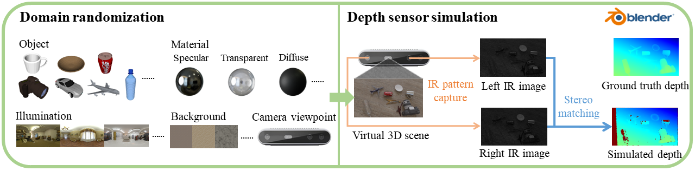

# Domain Randomization-Enhanced Depth Sensor Simulator 


## Installation
### IR rendering (Blender)
- Download [Blender 2.93.3 (Linux x64)](https://download.blender.org/release/Blender2.93/blender-2.93.3-linux-x64.tar.xz) compressed file and uncompress.
- Download the [environment map asset](https://mirrors.pku.edu.cn/dl-release/DREDS_ECCV2022/simulator/envmap_lib.tar.gz) and the [blend file](https://mirrors.pku.edu.cn/dl-release/DREDS_ECCV2022/simulator/material_lib_v2.blend).
- Install the Python packages (Numpy, etc.) into the Blender built-in Python environment. 
```
cd /home/YourUserName/blender-2.93.3-linux-x64/2.93/python/bin
./python3.9 -m ensurepip
./python3.9 -m pip install --upgrade pip --user
./python3.9 -m pip install numpy --user
```

### Stereo matching
- Create a new Anaconda virtual environment
```
conda create --name DepthSensorSimulator python=3.9
conda activate DepthSensorSimulator
```
- Install the packages: 
```
conda install pytorch==1.10.0 -c pytorch -c conda-forge
pip install -r requirement.txt
```

## Usage
- Run the shell script to start data generation, including RGB image, left and right IR images, GT depth, NOCS map, mask, and surface normal. Please set the correct Blender software package root path, working root path, GPU id, etc in run_renderer.sh and renderer.py.
```
bash run_renderer.sh
```
The rendered results would be saved in ./rendered_output.
- Run the stereo matching code for left and right IR images to get the simulated depth map.
```bash 
python stereo_matching.py
```
The simulated depths would also be saved in ./rendered_output. See [File Structure](https://github.com/PKU-EPIC/DREDS/tree/main/DepthSensorSimulator#file-structure)

## File Structure
```
Depth Sensor Simulator
├── envmap_lib                                
│   ├── abandoned_factory_canteen_01_1k.hdr
│   └── ...
├── texture
│   └── texture_0.jpg
├── cad_model
│   ├── 02691156
│   │   ├── 1a32f10b20170883663e90eaf6b4ca52
│   │   └── ...
│   └── ...
├── rendered_output                             # rendered results
│   ├── 00000                                   # scene id, including 30 frames
│   │   ├── 0000_color.png
│   │   ├── 0000_coord.png                      # NOCS map (category-level pose annotation)
│   │   ├── 0000_depth_120.exr                  # GT depth
│   │   ├── 0000_ir_l.png                       # left IR images
│   │   ├── 0000_ir_r.png                       # right IR images
│   │   ├── 0000_mask.exr                       
│   │   ├── 0000_meta.txt                       # 
│   │   ├── 0000_normal.exr                    
│   │   ├── 0000_simDepthImage.exr              # simulated depth calculated from the stereo IR images
│   │   └── ...
│   ├── 00001
│   └── ...
├── material_lib_v2.blend
├── run_renderer.sh
├── renderer.py
├── modify_material.py
└── stereo_matching.py
```

## Todo
- Detailed user instruction