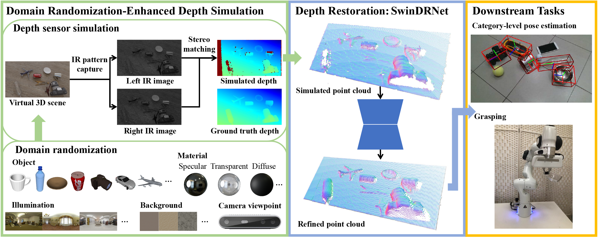

# Domain Randomization-Enhanced Depth Simulation and Restoration for Perceiving and Grasping Specular and Transparent Objects (ECCV 2022)

This is the official repository of [**Domain Randomization-Enhanced Depth Simulation and Restoration for Perceiving and Grasping Specular and Transparent Objects**](http://arxiv.org/abs/2208.03792).

For more information, please visit our [**project page**](https://pku-epic.github.io/DREDS/).

## Introduction


 This paper investigates the problem of specular and transparent object depth simulation and restoration. We propose a system composed of a RGBD fusion network **SwinDRNet** for depth restoration, along with a **synthetic data generation pipeline, Domain Randomization-Enhanced Depth Simulation**, to generate the large-scale **synthetic RGBD dataset, DREDS**, that contains 130k photorealistic RGB images and simulated depths with realistic sensor noise. We also curate a **real-world dataset, STD**, that captures 30 cluttered scenes composed of 50 objects with various materials from specular, transparent, to diffuse. Experiments demonstrate that training on our simulated data, SwinDRNet can directly generalize to real RGBD images and significantly boosts the performance of perception and interaction tasks (e.g. **category-level pose estimation, object grasping**)

## Overview
This repository provides:
- [Dataset: DREDS (simulated), STD (real)](https://github.com/PKU-EPIC/DREDS#dataset)
- Blender-python code and asset of [Domain randomization-enhanced depth sensor simulator](https://github.com/PKU-EPIC/DREDS/blob/main/DepthSensorSimulator)
- PyTorch code and weights of [Depth restoration network SwinDRNet](https://github.com/PKU-EPIC/DREDS/blob/main/SwinDRNet)
- PyTorch code and weights of [SwinDRNet baseline for category-level pose estimation](https://github.com/PKU-EPIC/DREDS/blob/main/CatePoseEstimation)

## Dataset
<!-- Please download the compressed files and store them from  -->
### DREDS dataset (simulated)
- [**DREDS-CatKnown**](https://mirrors.pku.edu.cn/dl-release/DREDS_ECCV2022/data/DREDS-CatKnown/): 100,200 training and 19,380 testing RGBD images made of 1,801 objects spanning 7 categories from ShapeNetCore, with randomized specular, transparent, and diffuse materials.
- [**DREDS-CatNovel**](https://mirrors.pku.edu.cn/dl-release/DREDS_ECCV2022/data/DREDS-CatNovel/): 11,520 images of 60 category-novel objects, which is transformed from GraspNet-1Billion that contains CAD models and annotates poses, by changing their object materials to specular or transparent, to verify the ability to generalize to new object categories.

### STD dataset (real)
- [**STD-CatKnown**](https://mirrors.pku.edu.cn/dl-release/DREDS_ECCV2022/data/STD-CatKnown/): 27000 RGBD images of 42 category-level objects spanning 7 categories, captured from 25 different scenes with various backgrounds and illumination.
- [**STD-CatNovel**](https://mirrors.pku.edu.cn/dl-release/DREDS_ECCV2022/data/STD-CatNovel/): 11000 data of 8 category-novel objects from 5 scenes.

### CAD models
We provide the [**CAD models**](https://mirrors.pku.edu.cn/dl-release/DREDS_ECCV2022/data/cad_model/) of our DREDS and STD dataset, including: 1,801 of DREDS-CatKnown (syn_train & syn_test), 42 of STD-CatKnown (real_cat_known), and 8 of STD-CatNovel (real_cat_known).

NOTE: The data is only for non-commercial use.

## Citation
If you find our work useful in your research, please consider citing:

```
@inproceedings{dai2022dreds,
	title={Domain Randomization-Enhanced Depth Simulation and Restoration for Perceiving and Grasping Specular and Transparent Objects},
	author={Dai, Qiyu and Zhang, Jiyao and Li, Qiwei and Wu, Tianhao and Dong, Hao and Liu, Ziyuan and Tan, Ping and Wang, He},
	booktitle={European Conference on Computer Vision (ECCV)},
	year={2022}
    }
```

## License

 This work and the dataset are licensed under [CC BY-NC 4.0][cc-by-nc].

 [![CC BY-NC 4.0][cc-by-nc-image]][cc-by-nc]

 [cc-by-nc]: https://creativecommons.org/licenses/by-nc/4.0/
 [cc-by-nc-image]: https://licensebuttons.net/l/by-nc/4.0/88x31.png

## Contact
If you have any questions, please open a github issue or contact us:

Qiyu Dai: qiyudai@pku.edu.cn, Jiyao Zhang: zhangjiyao@stu.xjtu.edu.cn, Qiwei Li: lqw@pku.edu.cn, He Wang: hewang@pku.edu.cn