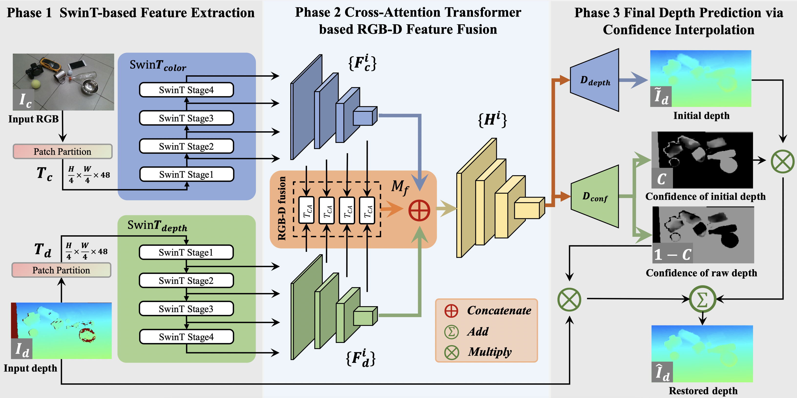

SwinDRNet
----------

This is the official implementation of SwinDRNet, a depth restoration network proposed in _["Domain Randomization-Enhanced Depth Simulation and Restoration for Perceiving and Grasping Specular and Transparent Objects"](https://arxiv.org/abs/2208.03792)_. SwinDRNet takes inputs of a colored RGB image along with its aligned depth image and outputs a refined depth that restores the error area of the depth image and completes the invalid area caused by specular and transparent objects. The refined depth can be directly used for some downstream tasks (e.g., category-level object 6D pose estimation and robotic grasping). For more details, please see our paper and video.



## System Dependencies
```bash
$ sudo apt-get install libhdf5-10 libhdf5-serial-dev libhdf5-dev libhdf5-cpp-11
$ sudo apt install libopenexr-dev zlib1g-dev openexr
```
## Setup
- ### Install pip dependencies
We have tested on Ubuntu 20.04 with an NVIDIA GeForce RTX 2080 and NVIDIA GeForce RTX 3090 with Python 3.7. The code may work on other systems.Install the dependencies using pip:
```bash
$ pip install -r requirments.txt
```
- ### Download dataset and models

1. Download the pre-trained model, our model and dataset. In the scripts below, be sure to comment out files you do not want, as they are very large. Alternatively, you can download files [manually](https://mirrors.pku.edu.cn/dl-release/DREDS_ECCV2022/)

```bash
# Download DREDS and STD Dataset
$ cd data
$ bash DOWNLOAD.sh
$ cd ..

# Download the pretrained model
$ cd pretrained_model
$ bash DOWNLOAD.sh
$ cd ..

# Download our model
$ cd models
$ bash DOWNLOAD.sh
$ cd ..
```
2. Extract the downloaded dataset and merge the train split of DREDS-CatKnown following the file structure.
```
data
├── DREDS                              
│   ├── DREDS-CatKnown
│   │   ├── train
│   │   │   ├── 00001
│   │   │   └── ...
│   │   ├── val
│   │   │   ├── 01162
│   │   │   └── ...
│   │   └── test
│   │       ├── 00000
│   │       └── ...
│   └── DREDS-CatNovel
│       ├── 00029
│       └── ...
└── STD
    ├── STD-CatKnown
    │   ├── test_0
    │   └── ...
    └── STD-CatNovel
        ├── test_novel_0-1
        └── ...
```

## Training
Below is an example for training a SwinDRNet model using the train split of DREDS-CatKnown dataset:
```bash
# An example command for training
$ python train.py --train_data_path PATH_DRED_CatKnown_TrainSplit --val_data_path PATH_DRED_CatKnown_ValSplit --val_data_type sim/real
```
## Testing
Below is an example for testing the trained SwinDRNet model:
```bash
# An example command for testing
$ python inference.py --train_data_path PATH_DRED_CatKnown_TrainSplit --val_data_path PATH_DRED_CatKnown_TestSplit --val_data_type sim/real
```
